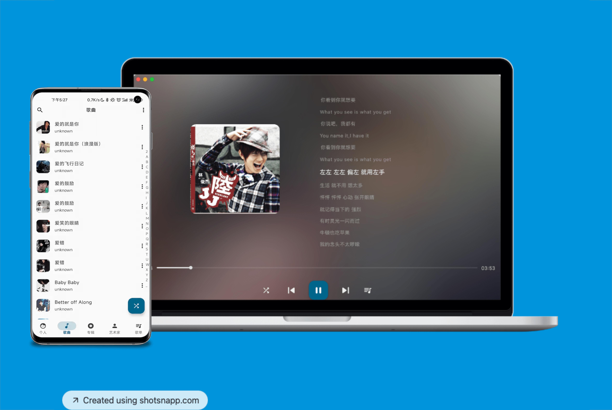

# Cotton Music 棉花音乐

CottonMusic 棉花音乐 [官网](https://music.caij.xyz/)  
Google Play: [Install](https://play.google.com/store/apps/details?id=com.caij.puremusic)  
APK/PC 下载：[https://github.com/pure-music/PureMusic/releases](https://github.com/pure-music/PureMusic/releases)

如果你觉得对你有帮助**关注一下开发者** [Caij](https://github.com/Caij) 非常感谢  

**目前pc版仅兴趣维护，不做强力支持**

# 棉花音乐
随时随地听音乐

目前支持Android、iOS、Mac、Windows、Linux 后续继续支持其他平台  
支持本地歌曲、百度网盘、阿里云盘、WebDAV、GoogleDrive、OneDrive、Dropbox等网盘歌曲播放，支持Plex、Emby、Jelly、Subsonic媒体服务器。
**存在需要付费服务，具体可以到官网查看**
 

# 音乐工具
[music-tag-web](https://github.com/xhongc/music-tag-web) 音乐标签编辑器，可编辑本地音乐文件的元数据（Editable local music file metadata), 支持主流的文件格式，并且后台支持Subsonic服务。  
[navidrome](https://github.com/navidrome/navidrome) 音乐挂载服务

# Thanks   
该项目早期复制于*RetroMusicPlayer*，相关代码已开源代码。  
目前最新版本已经基于跨平台重写开发，不再开源。  

