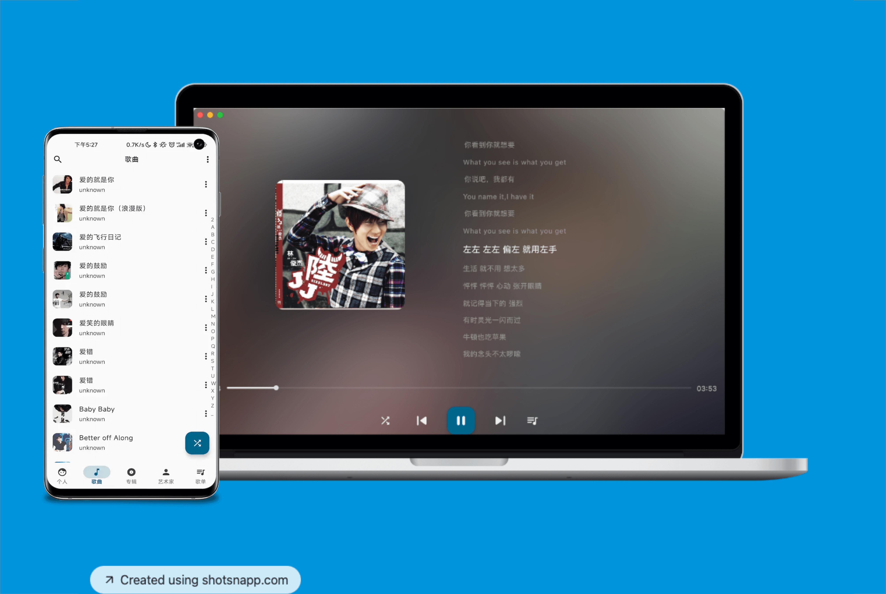

# Cotton Music
[English](README.md) ｜ [中文](README_ZH.md)  
  

Cotton Music official website: [https://music.caij.xyz/](https://music.caij.xyz/)  
Google Play: [Install](https://play.google.com/store/apps/details?id=com.caij.puremusic)  
APK/PC downloads: [https://github.com/pure-music/PureMusic/releases](https://github.com/pure-music/PureMusic/releases)

If this project helps you, please consider following the developer [Caij](https://github.com/Caij). Thank you very much.

**The PC version is currently maintained as a hobby project and does not receive strong support.**

# Cotton Music
Listen to music anytime, anywhere.

Currently supports Android, iOS, macOS, Windows, and Linux, with more platforms planned in the future.  
Supports playback of Local stored, BaiduDrive, AlibabaDrive, WebDAV, Google Drive, OneDrive, Dropbox, and other cloud storage services. Also supports media servers such as Plex, Emby, Jellyfin, Subsonic, and Navidrome.  
**Some services may require a paid subscription. Please check the official website for details.**

# Music Tools
[music-tag-web](https://github.com/xhongc/music-tag-web) A music tag editor for editing metadata in local music files. It supports mainstream file formats and also provides backend support for the Subsonic service.  
[navidrome](https://github.com/navidrome/navidrome) A music library hosting service.

# Thanks
This project was originally based on *RetroMusicPlayer*, and the related code was open source.  
The latest version has since been rewritten as a cross-platform application and is no longer open source.  

