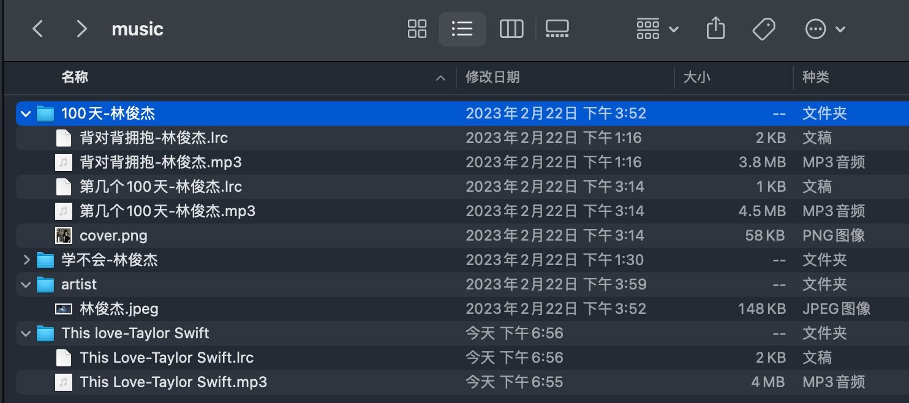

## 最佳实践
### 文件排版设计
歌曲、歌词及歌手最佳实践.
#### 网盘歌曲（推荐）
暂时支持阿里云盘、WebDAV、OneDrive、Google Drive、Dropbox  
对于其他网盘可以转为WebDAV协议适用，参考 https://github.com/alist-org/alist （非技术用户有一定的门槛，后续会出详细教程）

**文件扫描格式**
* 专辑名文件夹: 专辑名-歌手  
* 专辑封面图: 歌曲图片和专辑封面用同一张，放在专辑文件夹下命名为cover.png(jpg)  
* 歌手封面：新建artist文件夹，命名为歌手名.png(jpg)  
* 歌曲文件名: 专辑名-歌手，（如过没有歌手名直接默认使用专辑歌手名，如过都没有就会读取歌曲文件中的歌手名）
* 歌词: 保存在歌曲同一个目录，已经文件名保持一致，文件格式是lrc 
* 目录设置：默认从网盘根目录扫描4层文件夹。

**装载网盘**
* 可指定文件夹，指定文件夹格式如 /music，就会从music开始扫描4层文件夹。
* 不指定文件夹直接默认从网盘根目录扫描。

网盘歌曲播放时自动缓存，仅需下载一次。

### 本地手机歌曲
遵循google 官方规范，Android手机自动识别整理生成数据。

**所有文件改动后需要在app歌曲源内重新刷新同步数据**

